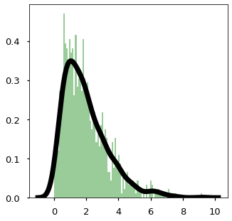

# Density Estimation

## Main Idea

<figure align="center">

<figcaption><b>Fig 1</b>: Input Distribution.</figcaption>
</figure>


$$P(x \in [a,b]) = \int_a^b p(x)dx$$


#### Likelihood

Given a dataset $\mathcal{D} = \{x^{1}, x^{2}, \ldots, x^{n}\}$, we can find some parameters $\theta$ by solving this optimization function: the likelihood

$$\underset{\theta}{\text{max}} \sum_i \log p_\theta(x^{(i)})$$

or equivalently:

$$\underset{\theta}{\text{min }} \mathbb{E}_x \left[ - \log p_\theta(x) \right]$$

This is equivalent to minimizing the KL-Divergence between the empirical data distribution $\tilde{p}_\text{data}(x)$ and the model $p_\theta$.

$$
D_\text{KL}(\hat{p}(\text{data}) || p_\theta)
= \mathbb{E}_{x \sim \hat{p}_\text{data}}
\left[ - \log p_\theta(x) \right] - H(\hat{p}_\text{data})
$$

where $\hat{p}_\text{data}(x) = \frac{1}{n} \sum_{i=1}^N \mathbf{1}[x = x^{(i)}]$

#### Stochastic Gradient Descent

Maximum likelihood is an optimization problem so we can use stochastic gradient descent (SGD) to solve it. This algorithm minimizes the expectation for $f$ assuming it is a differentiable function of $\theta$.

$$\argmin_\theta \mathbb{E} \left[ f(\theta) \right]$$

With maximum likelihood, the optimization problem becomes:

$$\argmin_\theta \mathbb{E}_{x \sim \hat{p}_\text{data}} \left[ - \log p_\theta(x) \right]$$

We typically use SGD because it works with large datasets and it allows us to use deep learning architectures and convenient packages.


---

### Example

#### Mixture of Gaussians

$$p_\theta(x) = \sum_i^k \pi_i \mathcal{N}(x ; \mu_i, \sigma_i^2)$$

where we have parameters as $k$ means, variances and mixture weights,

$$\theta = (\pi_1, \cdots, \pi_k, \mu_1, \cdots, \mu_k, \sigma_1, \cdots, \sigma_k)$$

However, this doesn't really work for high-dimensional datasets. To sample, we pick a cluster center and then add some Gaussian noise.

---

## Histogram Method

The simplest non-parametric density estimator. We partition the domain into bins and estimate the density by counting samples in each bin:

$$\hat{p}(x) = \frac{\text{count in bin containing } x}{N \cdot \Delta}$$

where $N$ is the total number of samples and $\Delta$ is the bin width. The main trade-off is bin width: too wide and we lose detail, too narrow and the estimate becomes noisy.

---

## Kernel Density Estimation

Kernel Density Estimation (KDE) is a non-parametric method that provides a smoother alternative to histograms. Given $N$ samples $\{x_1, \ldots, x_N\}$, the KDE estimate is:

$$\hat{p}(x) = \frac{1}{Nh} \sum_{i=1}^{N} K\left(\frac{x - x_i}{h}\right)$$

where $K(\cdot)$ is a kernel function (typically Gaussian) and $h > 0$ is the bandwidth parameter.

### Bandwidth Selection

The bandwidth $h$ controls the smoothness of the estimate:

* **Too small**: overfitting, noisy estimate
* **Too large**: oversmoothing, loss of detail

Common selection methods include Scott's rule ($h = 1.06 \hat{\sigma} N^{-1/5}$) and Silverman's rule.

### Role in RBIG

In the RBIG pipeline, KDE is one option for estimating the marginal CDF $F_d(x_d)$ during the [uniformization](uniformization.md) step.

### Resources

* Jake Vanderplas - [In Depth: Kernel Density Estimation](https://jakevdp.github.io/PythonDataScienceHandbook/05.13-kernel-density-estimation.html)

---

## Implementation Notes

### Search Sorted


**NumPy**

```python
indices = np.searchsorted(bin_locations, inputs)
```

**PyTorch**

```python
indices = torch.searchsorted(bin_locations, inputs)
```

Both NumPy and PyTorch provide built-in `searchsorted` functions that efficiently find insertion points in sorted arrays.
