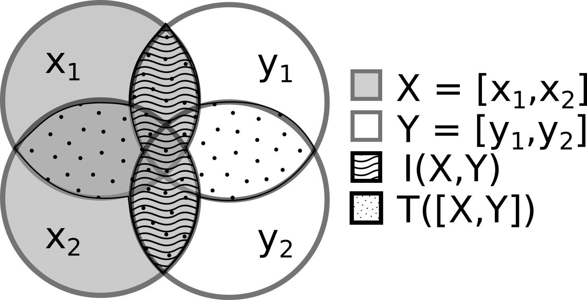

# Information Theory Measures

- [Summary](#summary)
- [Information](#information)
- [Entropy](#entropy)
- [Mutual Information](#mutual-information)
- [Total Correlation (Mutual Information)](#total-correlation-mutual-information)
- [Kullback-Leibler Divergence (KLD)](#kullback-leibler-divergence-kld)

## Summary

<figure align="center">

<figcaption><b>Fig 1</b>: Information Theory measures in a nutshell.</figcaption>
</figure>

## Information

The information content (or surprisal) of an event $x$ with probability $p(x)$ is:

$$I(x) = -\log p(x)$$

Rare events carry more information than common ones.

## Entropy

The entropy of a random variable $X$ with PDF $p(x)$ is the expected information content:

$$H(X) = -\int p(x) \log p(x) \, dx$$

Entropy measures the uncertainty or randomness of a distribution. A Gaussian distribution has the maximum entropy among all distributions with a given mean and variance. See [Gaussian Distribution](gaussian_distribution.md#entropy) for the closed-form expression.

## Mutual Information

The mutual information between two random variables $X$ and $Y$ measures the amount of information shared between them:

$$I(X; Y) = H(X) + H(Y) - H(X, Y)$$

Equivalently:

$$I(X; Y) = D_\text{KL}\left[ p(x, y) \| p(x)p(y) \right]$$

Mutual information is zero if and only if $X$ and $Y$ are independent.

## Total Correlation (Mutual Information)

This is a term that measures the statistical dependency of multi-variate sources using the common mutual-information measure.

$$
\begin{aligned}
I(\mathbf{x})
&=
D_\text{KL} \left[ p(\mathbf{x}) || \prod_d p(\mathbf{x}_d) \right] \\
&= \sum_{d=1}^D H(x_d) - H(\mathbf{x})
\end{aligned}
$$

where $H(\mathbf{x})$ is the differential entropy of $\mathbf{x}$ and $H(x_d)$ represents the differential entropy of the $d^\text{th}$ component of $\mathbf{x}$. This is nicely summarized in equation 1 from ([Lyu & Simoncelli, 2008][1]).

> **Note**: In 2 dimensions, the total correlation $I$ is equivalent to the mutual information.

We can decompose this measure into two parts representing second order and higher-order dependencies:

$$
\begin{aligned}
I(\mathbf{x})
&=
\underbrace{\sum_{d=1}^D \log{\Sigma_{dd}} - \log{|\Sigma|}}_{\text{2nd Order Dependencies}} \\
&-
\underbrace{D_\text{KL} \left[ p(\mathbf{x}) || \mathcal{G}_\theta (\mathbf{x}) \right]
-
\sum_{d=1}^D D_\text{KL} \left[ p(x_d) || \mathcal{G}_\theta (x_d) \right]}_{\text{high-order dependencies}}
\end{aligned}
$$

again, nicely summarized with equation 2 from ([Lyu & Simoncelli, 2008][1]).

**Sources**:
* Nonlinear Extraction of "Independent Components" of elliptically symmetric densities using radial Gaussianization - Lyu & Simoncelli - [PDF](https://www.cns.nyu.edu/pub/lcv/lyu08a.pdf)

[1]: https://www.cns.nyu.edu/pub/lcv/lyu08a.pdf "Nonlinear Extraction of 'Independent Components' of elliptically symmetric densities using radial Gaussianization - Lyu & Simoncelli - (2008)"

## Kullback-Leibler Divergence (KLD)

The KL-Divergence measures the difference between two probability distributions $p$ and $q$:

$$D_\text{KL}(p || q) = \int p(x) \log \frac{p(x)}{q(x)} \, dx$$

See [RBIG](rbig.md#kl-divergence) for how RBIG can be used to estimate the KLD.

---

## Notebooks

- [Information Theory](../notebooks/06_information_theory.ipynb) — functional API for TC, entropy, MI, KLD
- [Dependence: 1D](../notebooks/09_dependence_1d.ipynb) — MI vs linear correlation on scalar variables
- [Dependence: 2D](../notebooks/10_dependence_2d.ipynb) — MI for multivariate dependence detection
- [Real-World IT](../notebooks/11_real_world_it.ipynb) — IT measures on synthetic financial data
