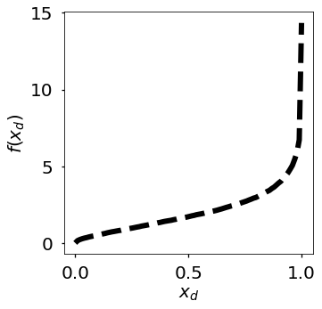
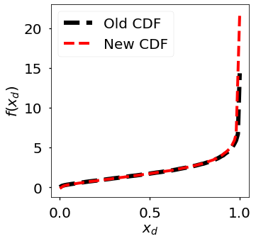

# Marginal Gaussianization

> A dimension-wise transform, whose Jacobian is a diagonal matrix.

* Author: J. Emmanuel Johnson
* Website: [jejjohnson.netlify.com](https://jejjohnson.netlify.com)
* Email: jemanjohnson34@gmail.com
* Notebooks:
  * [Marginal Uniformization](https://colab.research.google.com/drive/1aJaELyFPlFFROozW-S51VBZ4PfpBeSVR)
  * [Inverse Gaussian CDF](https://colab.research.google.com/drive/1spSjeUpTF1b2euZ0TE6c2ZrHQZC_p4gm)

---


- [Idea](#idea)
- [High-Level Instructions](#high-level-instructions)
- [Mathematical Details](#mathematical-details)
  - [Data](#data)
- [Marginal Uniformization](#marginal-uniformization)
  - [Histogram Estimation](#histogram-estimation)
- [Gaussianization of Uniform Variable](#gaussianization-of-uniform-variable)
- [Log Determinant Jacobian](#log-determinant-jacobian)
- [Log-Likelihood of the Data](#log-likelihood-of-the-data)
- [Quantile Transform](#quantile-transform)
- [KDE Transform](#kde-transform)
- [Spline Functions](#spline-functions)
- [Gaussian Transform](#gaussian-transform)


## Idea

The idea is to transform each dimension/feature into a Gaussian distribution, i.e. Marginal Gaussianization. We will convert each of the marginal distributions to a Gaussian distribution of mean 0 and variance 1. You can follow along in this [colab notebook](https://colab.research.google.com/drive/1Zk1UnfN573yOIdtHUI-tbzks8MMLtuy-) for a high-level demonstration.

---

## High-Level Instructions

1. Estimate the cumulative distribution function for each feature independently.
2. Obtain the CDF and ICDF
3. Mapped to desired output distribution.

**Demo: TODO**
* Marginal PDF
  * $x_d$ vs $p(x_d)$
* Uniform Transformation
  * $x_d$ vs $u=U(x_d)$
* PDF of the uniformized variable
  * $u$ vs $p(u)$
* Gaussianization transform
  * $u$ vs $G(u)$
* PDF of the Gaussianized variable
  * $G(u)=\Psi(x_d)$ vs $p_d(\Psi(x_d))$

---

## Mathematical Details

For all instructions in the following, we will assume we are looking at a univariate distribution to make the concepts and notation easier. Overall, we can essentially break these pieces up into two steps: 1) we make the marginal distribution uniform and 2) we make the marginal distribution Gaussian.

---

### Data

In this example, let's assume $x$ comes from a univariate distribution. To make it interesting, we will be using the $\Gamma$ PDF:

$$f(x,a) = \frac{x^{a-1}\exp{(-x)}}{\Gamma(a)}$$

where $x \geq 0, a > 0$ and $\Gamma(a)$ is the gamma function with the parameter $a$.

<figure align="center">

<figcaption><b>Fig 1</b>: Input Distribution.</figcaption>
</figure>

This distribution is very skewed so through-out this tutorial, we will transform this distribution to a normal distribution.

---

## Marginal Uniformization

The first step, we map $x_d$ to the uniform domain $U_d$. This is based on the cumulative distribution of the PDF. 

$$u = U_d (x_d) = \int_{-\infty}^{x_d} p_d (x_d') \, d x_d'$$

---

### Histogram Estimation

We estimate the CDF by computing empirical quantiles from the data samples. Below we use the `np.percentile` function which essentially calculates q-th percentile for an element in an array.


```python

# number of quantiles
n_quantiles = 100
n_quantiles = max(1, min(n_quantiles, n_samples))  # check to ensure the quantiles make sense

# calculate reference values
references = np.linspace(0, 1, n_quantiles, endpoint=True)

# calculate kth percentile of the data along the axis
quantiles = np.percentile(X_samples, references * 100)
```

<figure align="center">

<figcaption><b>Fig 2</b>: CDF.</figcaption>
</figure>

**Extending the Support**

We need to extend the support of the distribution because it may be the case that we have data that lies outside of the distribution. In this case, we want to be able to map those datapoints with the CDF function as well. This is a very simple operation because we need to just squash the CDF function such that we have more values between the end points of the support and the original data distribution. Below, we showcase an example where we extend the CDF function near the tails. 

<figure align="center">

<figcaption><b>Fig 3</b>: CDF with extended support. We used approximately 1% extra on either tail.</figcaption>
</figure>

Looking at figure 3, we see that the new function has the same support but the tail is extended near the higher values. This corresponds to the region near the right side of the equation in figure 1.


## Gaussianization of Uniform Variable

Once we have the uniform variable $u \in [0,1]$, we apply the inverse CDF of the standard Gaussian distribution to obtain a Gaussian variable:

$$z_d = \Phi^{-1}(u_d)$$

where $\Phi^{-1}$ is the quantile function (inverse CDF) of $\mathcal{N}(0,1)$. More generally, the Gaussian CDF is defined as:

$$G(x_d) = \int_{-\infty}^{x_d} g(x_d') \, d x_d'$$

where $g(\cdot)$ is the standard Gaussian PDF.

---

## Log Determinant Jacobian


$$\frac{d F^{-1}}{d x} = \frac{1}{f(F^{-1}(x))}$$

Taking the $\log$ of this function

$$\log{\frac{d F^{-1}}{d x}} = -\log{f(F^{-1}(x))}$$

This is simply the log (absolute) determinant of the Jacobian of the transformation:

$$\log{\left|\frac{d F^{-1}}{d x}\right|} = -\log{f(F^{-1}(x))}$$

---

## Log-Likelihood of the Data

$$\log \mathcal{L} = \frac{1}{N} \sum_{n=1}^N \log p(x_n)$$


## Quantile Transform

An alternative approach to marginal Gaussianization uses the quantile transform, which maps the empirical distribution to the desired output distribution via rank-based estimation.

1. Calculate the empirical ranks `numpy.percentile`
2. Modify ranking through interpolation, `numpy.interp`
3. Map to normal distribution by inverting CDF, `scipy.stats.norm.ppf`

**Sources**:
* PyTorch Percentile - [gist](https://gist.github.com/spezold/42a451682422beb42bc43ad0c0967a30) | [package](https://github.com/aliutkus/torchpercentile)
* Quantile Transformation with Gaussian Distribution - Sklearn Implementation - [StackOverFlow](https://stats.stackexchange.com/questions/325570/quantile-transformation-with-gaussian-distribution-sklearn-implementation)
* Differentiable Quantile Transformation - Miles Cranmer - [PyTorch](https://github.com/MilesCranmer/differentiable_quantile_transform)

## KDE Transform


## Spline Functions

* Rational Quadratic Trigonometric Interpolation Spline for Data Visualization - Lui et al - [PDF](https://www.hindawi.com/journals/mpe/2015/983120/)
* [TensorFlow](https://github.com/tensorflow/probability/blob/master/tensorflow_probability/python/bijectors/rational_quadratic_spline.py)
* PyTorch Implementations
  * Neural Spline Flows - [Paper](https://github.com/bayesiains/nsf)
  * Tony Duan Implementation - [Paper](https://github.com/tonyduan/normalizing-flows)

## Gaussian Transform