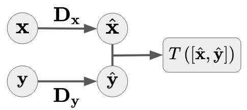
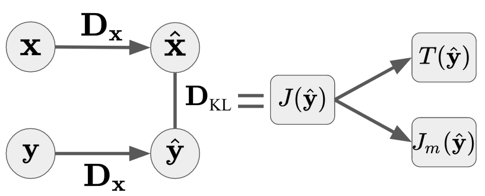

# RBIG Algorithm — Quick Reference

> For the full theory and hands-on walkthrough, see the
> [RBIG Walk-Through notebook](../notebooks/03_rbig_walkthrough.ipynb).

---

## Algorithm

$$\mathcal{G}: \mathbf{x}^{(k+1)} = \mathbf{R}_{(k)} \cdot \mathbf{\Psi}_{(k)}\!\left(\mathbf{x}^{(k)}\right)$$

| Step | Symbol | Description | Details |
|------|--------|-------------|---------|
| Marginal Gaussianization | $\mathbf{\Psi}$ | CDF → uniform → $\Phi^{-1}$ → Gaussian, per dimension | [Marginal Gaussianization](marginal_gaussianization.md) |
| Rotation | $\mathbf{R}$ | Orthogonal rotation (PCA, ICA, or random) | [Rotation](rotation.md) |

**Objective:** Minimize total correlation (equivalently, maximize negentropy).

---

## Information Theory Measures

RBIG enables estimation of classical IT quantities as by-products of the Gaussianization. See [Information Theory Measures](information_theory_measures.md) for definitions.

<figure align="center">

<figcaption>Information Theory measures computable via RBIG.</figcaption>
</figure>

### Entropy

Estimated by summing entropy reductions across all RBIG layers.

### Mutual Information

<figure align="center">

</figure>

$$I(\mathbf{X}, \mathbf{Y}) = T\!\left(\left[\mathcal{G}_\theta(\mathbf{X}),\; \mathcal{G}_\phi(\mathbf{Y})\right]\right)$$

### KL-Divergence

<figure align="center">

</figure>

$$D_\text{KL}\!\left[\mathbf{X} \| \mathbf{Y}\right] = J\!\left[\mathcal{G}_\theta(\hat{\mathbf{y}})\right]$$

---

## References

* Iterative Gaussianization: from ICA to Random Rotations — Laparra et al. (2011) — [Paper](https://arxiv.org/abs/1602.00229)
* Gaussianization — Chen & Gopinath (2000) — [PDF](https://papers.nips.cc/paper/1856-gaussianization.pdf)
